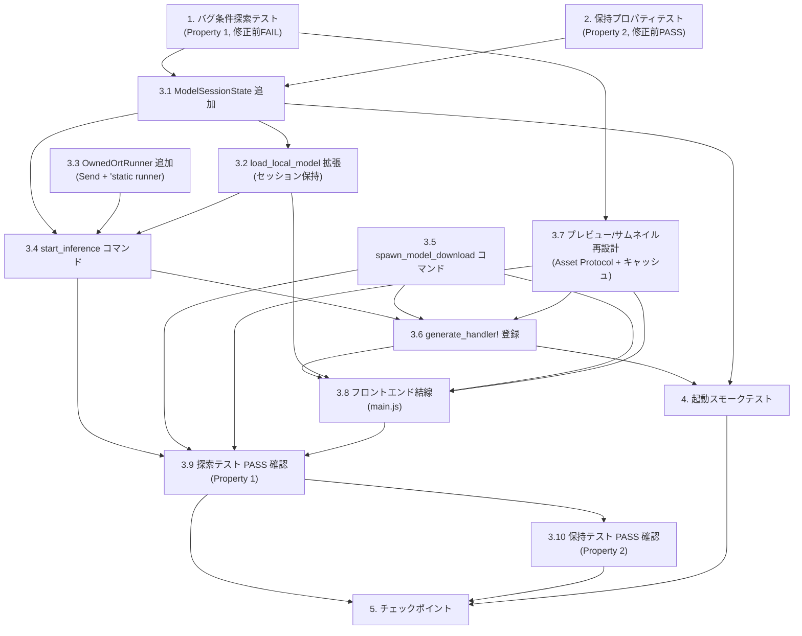

# Implementation Plan

## Overview

本 bugfix は、既存の同期コア（`run_inference_job` / `spawn_inference_job` / `run_inference` / `download_model` / `get_preview` / `get_thumbnail`）を変えず、アプリ層の結線（新コマンド・State・登録）とフロントの呼び出し・転送方式の追加のみで 4 系統の不具合を修正する。バグ条件方法論に従い、修正前に反例を可視化する探索テスト（Property 1）と既存挙動を観測する保持テスト（Property 2）を先に置き、実装後に両者で検証する。

- **Property 1: Fix Checking** — Bug_Condition を満たす入力（推論起動・セッション保持・ダウンロード spawn・軽量転送）で期待挙動を満たす（要件 2.1〜2.12）。
- **Property 2: Preservation** — Bug_Condition を満たさない入力で既存挙動・DTO 形状が不変（要件 3.1〜3.10）。

既存テストヘルパ（`src-tauri/src/commands/progress.rs` の `RecordingEmitter`、`adapters.rs`/`inference_service.rs` の `MockRunner`、`model_service.rs` の `MockDownloader`）を再利用する。

---

## Tasks

- [x] 1. バグ条件探索テストを書く（修正前・反例の可視化）
  - **Property 1: Bug Condition** - 推論起動・セッション保持・ダウンロード同期・JSON 転送の結線欠落
  - **CRITICAL**: このテストは未修正コードで FAIL する。失敗はバグの存在を証明するものであり、テストやコードを修正しようとしないこと
  - **NOTE**: このテストは期待挙動を符号化する。実装後に PASS することで修正を検証する
  - **GOAL**: `isBugCondition` が true を返す 4 経路それぞれで反例を出す
  - **Scoped PBT Approach**: 決定的な結線欠落のため、具体的な失敗ケースへスコープする（列挙的検査）
  - 反例 1（推論起動不在）: `start_inference` が未定義／`generate_handler!` に未登録であることを確認（未修正では該当コマンドが無く FAIL）
  - 反例 2（セッション保持不在）: `load_local_model` 呼び出し後にアプリ層 State から `LoadedModel`（`ort::Session`）を参照する手段が無く、推論 runner を構築できないことを確認（design Bug Condition の (b)）
  - 反例 3（ダウンロード同期・進捗なし）: `download_model` が同期でブロックし、`spawn_model_download` が未定義／未登録で進捗イベントが発火しないことを確認（design Bug Condition の (c)）
  - 反例 4（プレビュー JSON 転送）: `get_preview`/`get_thumbnail` の戻り値 `png` が `Vec<u8>` で JSON 数値配列化され、フロント `frontend/main.js` が `pngBytesToDataUrl` を経由することを確認（design Bug Condition の (d)）
  - 未修正コードで実行
  - **EXPECTED OUTCOME**: テスト FAIL（バグが存在することの証明）
  - 反例を文書化して根本原因（結線欠落・状態管理不在・同期実行・JSON 転送）を理解する
  - _Requirements: 2.1, 2.2, 2.3, 2.4, 2.5, 2.6, 2.7, 2.8, 2.9, 2.10, 2.11, 2.12_

- [x] 2. 保持プロパティテストを書く（修正前・観測優先）
  - **Property 2: Preservation** - 非該当入力の既存挙動と DTO 形状の不変性
  - **IMPORTANT**: 観測優先方法論に従う。未修正コードの挙動を観測してからテストを書く
  - 観測 1（既存コマンド不変）: `list_images`/`bulk_add_tags`/`sort_files`/`rename_regex`/`find_orphan_captions`/`capabilities`/`create_symlink`/`convert_path` の戻り値・エラー種別を観測（3.1）
  - 観測 2（同期コア不変）: `run_inference_job`/`spawn_inference_job` の進捗単調非減少・最終 done==total・キャンセル反映・部分失敗時の処理前状態保持を `RecordingEmitter`/`MockRunner` で観測（3.2）
  - 観測 3（一覧・DTO 形状不変）: `list_models` のローカル/リモート一覧と ONNX 非対応の `available`/`excluded` 区分（3.3）、`LoadedModelInfo` の `input_size`/`label_count`（3.4）、`PreviewData`/`ThumbnailData` の `width`/`height`/`png`/`placeholder`（3.10）を観測
  - 観測 4（代替表示・クランプ・縮小規約）: 破損画像で `placeholder=true`（3.7）、サムネイル 64〜512 クランプとアスペクト比保持縮小（拡大なし）（3.8）、プレビュー `MAX_PREVIEW_SIZE(2048)` 超のみ内接縮小（3.9）を観測
  - 観測 5（キャンセル戻り値）: `cancel_operation` が登録済み `true`／未登録 `false`（3.5）、非 Windows で `capabilities` が `windows_only: false`（3.6）を観測
  - プロパティベーステスト（多数入力生成）で観測挙動の不変性を検証。既存 PBT（`tests/pbt_*`）のジェネレータ・パターンを流用
  - 未修正コードで実行
  - **EXPECTED OUTCOME**: テスト PASS（保持すべきベースライン挙動の確認）
  - _Requirements: 3.1, 3.2, 3.3, 3.4, 3.5, 3.6, 3.7, 3.8, 3.9, 3.10_

- [x] 3. 不具合 1〜4 の修正（結線・State・転送方式の追加）

  - [x] 3.1 アプリ層モデルセッション状態管理（ModelSessionState）を追加する
    - `src-tauri/src/app.rs`（または `src-tauri/src/commands/` の補助モジュール）に `ModelSessionState { current: Mutex<Option<LoadedModel>> }` を追加する
    - `LoadedModel` は非 serde・非 Sync（`ort::Session::run` が `&mut` 前提）のため `Mutex` で包む。まず単一保持で最小結線し、必要なら `Mutex<HashMap<String, LoadedModel>>` へ拡張
    - `app.rs` の `Builder` に `.manage(ModelSessionState::default())` を追加する
    - _Bug_Condition: isBugCondition(input) where input.kind IN [SelectModel, ModelDownloaded]（design (b)）_
    - _Expected_Behavior: ロード済み LoadedModel をアプリ層 State に保持し推論から参照可能（Property 1 (b)）_
    - _Preservation: 既存 DTO・同期コア不変（design Preservation Requirements）_
    - _Requirements: 2.4, 2.5_

  - [x] 3.2 `load_local_model` を拡張してセッションを保持する
    - `src-tauri/src/commands/adapters.rs` の `load_local_model` を `State<ModelSessionState>` を受け取る形へ拡張する
    - `model_service::load_local_model` が返す `LoadedModel` を `state.current` に格納し、戻り値は `LoadedModelInfo { input_size, label_count }` を維持する（保持 3.4）
    - リモートモデルは、ダウンロード完了後の保存先ディレクトリを `model_service::load_local_model` に渡してロードし同じ State に保持する経路を追加する（期待 2.5）
    - _Bug_Condition: isBugCondition(input) where input.kind IN [SelectModel, ModelDownloaded]_
    - _Expected_Behavior: セッション保持・LoadedModelInfo 形状維持（Property 1 (b)）_
    - _Preservation: LoadedModelInfo の input_size/label_count 形状不変（3.4）_
    - _Requirements: 2.4, 2.5, 3.4_

  - [x] 3.3 所有権を持つ Send な推論 runner（OwnedOrtRunner）を追加する
    - `OrtSessionRunner<'a>` は `&'a mut ort::Session` を借用しライフタイム付きで `'static` を満たさない。`spawn_inference_job<R: SessionRunner + Send + 'static>` にスレッド move できるよう、所有 `LoadedModel` を包む `OwnedOrtRunner { model: LoadedModel }` を新設し `SessionRunner` を実装する
    - 同期コア（`SessionRunner` トレイト・`run_inference_job`）は変更せず、実装追加のみで `'static + Send` を満たす（保持 3.2）
    - _Bug_Condition: isBugCondition(input) where input.kind == StartInference（design (a)）_
    - _Expected_Behavior: spawn_inference_job へ runner を move してバックグラウンド起動可能（Property 1 (a)）_
    - _Preservation: SessionRunner/run_inference_job の検証済み挙動を維持（3.2）_
    - _Requirements: 2.1, 3.2_

  - [x] 3.4 バッチ推論起動コマンド `start_inference` を追加する
    - `src-tauri/src/commands/adapters.rs` に `#[tauri::command] start_inference` を追加する。引数は `image_paths`/`threshold`/`batch_size`/`operation_id` と `State<ModelSessionState>`/`State<CancelRegistry>`/`AppHandle`
    - セッション未ロードなら `AppError`（モデル未選択/未ロード）を返しクラッシュしない（期待 2.6）
    - ロード済み `LoadedModel` から `labels`/`input_size`/`channel_order` を読み `InferenceJob` を組み立て、`OwnedOrtRunner` を構築して `spawn_inference_job` を起動する。進捗は `TauriProgressEmitter` で `inference://progress`（`PROGRESS_EVENT`）へ emit。完了時に `CancelRegistry` を解放する
    - _Bug_Condition: isBugCondition(input) where input.kind == StartInference AND NOT inferenceCommandInvoked_
    - _Expected_Behavior: spawn_inference_job 起動・進捗送出・完了時レジストリ解放・未ロードは AppError（Property 1 (a)）_
    - _Preservation: 同期コア不変（3.2）_
    - _Requirements: 2.1, 2.2, 2.3, 2.6_

  - [x] 3.5 モデルダウンロード spawn コマンド `spawn_model_download` を追加する
    - `src-tauri/src/commands/adapters.rs` に `#[tauri::command] spawn_model_download` を追加する。引数は `variant: ModelVariant`/`dest_dir`/`operation_id` と `State<CancelRegistry>`/`AppHandle`
    - 別スレッドで `model_service::download_model`（同期コア・不変）を実行し即戻る。取得段階（onnx 取得 → タグ定義取得 → 保存）に応じて進捗を `inference://progress` で通知する。`CancelRegistry::register` したフラグを取得段の境界で確認して中断する
    - 既存同期 `download_model` コマンドは互換のため残す（`spawn_model_download` へ委譲も可）。進捗をコアに通知させる場合は薄いラッパ `download_model_with_progress` を新設し、既存 `download_model` のシグネチャ・再試行・原子的保存・部分ファイル除去は据え置く
    - _Bug_Condition: isBugCondition(input) where input.kind == DownloadModel AND (downloadRunsSynchronously OR NOT downloadProgressSubscribed)_
    - _Expected_Behavior: 別スレッド spawn で即戻り・進捗通知・cancel_operation で中断（Property 1 (c)）_
    - _Preservation: download_model 同期コアと cancel_operation 戻り値を維持（3.2, 3.5）_
    - _Requirements: 2.7, 2.8, 2.9_

  - [x] 3.6 新コマンドを `generate_handler!` に登録する
    - `src-tauri/src/app.rs` の `tauri::generate_handler!` に `crate::commands::adapters::start_inference` と `crate::commands::adapters::spawn_model_download` を追加する
    - `download_model_with_progress` を追加した場合はそれも登録する
    - _Bug_Condition: isBugCondition(input) where input.kind IN [StartInference, DownloadModel]_
    - _Expected_Behavior: UI から新コマンドを invoke 可能（Property 1 (a)(c)）_
    - _Preservation: 既存登録コマンドの挙動不変（3.1）_
    - _Requirements: 2.1, 2.7_

  - [x] 3.7 プレビュー/サムネイル転送を再設計する（Asset Protocol + キャッシュ）
    - 案 A（推奨）: Rust 側で縮小 PNG をアプリキャッシュディレクトリへ書き出し、そのパスを返す新経路 `get_thumbnail_path`/`get_preview_path` を `src-tauri/src/commands/adapters.rs` に追加する。プレビューは `MAX_PREVIEW_SIZE` 以下なら元ファイルパスを直接返し、超過時のみ縮小ファイルパスを返す
    - 案 B（併用）: `src-tauri/src/services/file_service.rs` に `(path, size, mtime)` をキーにした簡易キャッシュ（LRU 等）を設け、同一画像の再デコード・再リサイズ・再エンコードを回避する（期待 2.12）
    - 既存 `get_preview`/`get_thumbnail` と `PreviewData`/`ThumbnailData` は削除せず新経路を **追加** する（保持 3.10）。失敗時 `placeholder` フォールバック（3.7）、サイズクランプ（3.8）、縮小規約（3.9）は現行ロジックを流用して不変に保つ
    - 新経路コマンドを `generate_handler!` に登録する
    - _Bug_Condition: isBugCondition(input) where input.kind IN [GetPreview, GetThumbnail] AND transferredAsJsonNumberArray_
    - _Expected_Behavior: JSON 数値配列を経ずファイルパス参照・再エンコード削減（Property 1 (d)）_
    - _Preservation: placeholder・クランプ・縮小規約・DTO 形状を維持（3.7, 3.8, 3.9, 3.10）_
    - _Requirements: 2.10, 2.11, 2.12, 3.7, 3.8, 3.9, 3.10_

  - [x] 3.8 フロントエンドの結線（`frontend/main.js`）
    - `ops.inferRun`: `operation_id` 発行・進捗購読の後に `invoke("start_inference", { imagePaths, threshold, batchSize, operationId })` を呼ぶ。TODO コメントを解消。未ロードエラーは `renderError` で表示
    - `ops.modelDownload`: `download_model` 直接 await を `spawn_model_download`（`operation_id` 付き）＋進捗購読＋キャンセル配線へ置き換える。完了後、保存先を `load_local_model` に渡してセッション保持へ繋ぐ（期待 2.5）
    - サムネイル/プレビュー: 案 A の `convertFileSrc(path)` 参照へ置き換え、`pngBytesToDataUrl` の使用を撤去する。`placeholder` 分岐は維持
    - _Bug_Condition: isBugCondition(input) 全 4 経路の UI 側_
    - _Expected_Behavior: start_inference/spawn_model_download 起動・convertFileSrc 参照・手動 Base64 撤去（Property 1 (a)(c)(d)）_
    - _Preservation: placeholder フォールバック維持（3.7）_
    - _Requirements: 2.1, 2.5, 2.8, 2.9, 2.10, 2.11_

  - [x] 3.9 バグ条件探索テストが PASS することを確認する
    - **Property 1: Expected Behavior** - 各要求が実際に起動・保持・軽量転送される
    - **IMPORTANT**: タスク 1 と同じテストを再実行する。新しいテストは書かない
    - タスク 1 のテストは期待挙動を符号化しており、PASS することで修正を確認する
    - 具体化検証: `start_inference` が `spawn_inference_job` を起動し `RecordingEmitter` 相当で進捗が単調・最終 done==total、完了で `CancelRegistry` が空、未ロード時は `AppError`（クラッシュなし）。`spawn_model_download` が即戻り・進捗通知・`cancel_operation` で中断（`MockDownloader` で確認）。新プレビュー/サムネイル経路が JSON 数値配列を経ず、同一入力再取得でキャッシュヒット
    - **EXPECTED OUTCOME**: テスト PASS（バグ修正の確認）
    - _Requirements: 2.1, 2.2, 2.3, 2.4, 2.5, 2.6, 2.7, 2.8, 2.9, 2.10, 2.11, 2.12_

  - [x] 3.10 保持テストが引き続き PASS することを確認する
    - **Property 2: Preservation** - 非該当入力の既存挙動と DTO 形状の不変性
    - **IMPORTANT**: タスク 2 と同じテストを再実行する。新しいテストは書かない
    - 既存 `file_service`/`model_service`/`adapters` の単体テストと既存 PBT（`tests/pbt_*`）が全て通ることを確認する
    - **EXPECTED OUTCOME**: テスト PASS（リグレッションなしの確認）
    - _Requirements: 3.1, 3.2, 3.3, 3.4, 3.5, 3.6, 3.7, 3.8, 3.9, 3.10_

- [x] 4. 起動スモークテスト（新コマンド登録・State 管理の確認）
  - `src-tauri/tests/smoke_app.rs` 相当で、`generate_handler!` に `start_inference`/`spawn_model_download`（および追加経路）が登録され、`ModelSessionState` が `manage` された状態でアプリが起動できることを確認する
  - 実 ort が利用可能な環境では、モデル選択 → 推論起動 → 進捗更新 → 完了/キャンセルの一連フローを 1〜2 例、ダウンロード → 保存先ロード → セッション保持 → 推論参照可能を 1 例（ネットワークはモックまたは限定実行）確認する
  - _Requirements: 2.1, 2.4, 2.5, 2.7_

- [x] 5. チェックポイント - 全テストの通過を確認する
  - 探索テスト（Property 1）が修正後 PASS、保持テスト（Property 2）が PASS、既存の全単体・プロパティテストが通ることを確認する
  - `cargo build` / `cargo test` を実行し、疑問があればユーザーに確認する
  - _Requirements: 2.1〜2.12, 3.1〜3.10_

---

## Task Dependency Graph



実行ウェーブ（同一ウェーブ内は並列実行可能、ウェーブは依存順）:

```json
{
  "waves": [
    {
      "wave": 1,
      "tasks": ["1", "2"],
      "description": "テスト先行。探索テスト(1)は修正前FAIL、保持テスト(2)は修正前PASSを確認"
    },
    {
      "wave": 2,
      "tasks": ["3.1", "3.3", "3.5", "3.7"],
      "description": "基盤・独立実装。ModelSessionState(3.1)・OwnedOrtRunner(3.3)・spawn_model_download(3.5)・プレビュー再設計(3.7)は相互独立に着手可能"
    },
    {
      "wave": 3,
      "tasks": ["3.2", "3.4"],
      "description": "State依存の結線。load_local_model拡張(3.2)は3.1、start_inference(3.4)は3.1/3.2/3.3に依存"
    },
    {
      "wave": 4,
      "tasks": ["3.6"],
      "description": "コマンド登録。generate_handler!登録(3.6)は3.4/3.5/3.7の新コマンド定義後"
    },
    {
      "wave": 5,
      "tasks": ["3.8"],
      "description": "フロント結線。main.js(3.8)は3.6/3.2/3.5/3.7に依存"
    },
    {
      "wave": 6,
      "tasks": ["3.9"],
      "description": "探索テストPASS確認(Property 1)。3.4/3.5/3.7/3.8に依存"
    },
    {
      "wave": 7,
      "tasks": ["3.10", "4"],
      "description": "保持テストPASS確認(3.10)と起動スモークテスト(4)。3.10は3.9後、4は3.6/3.1後"
    },
    {
      "wave": 8,
      "tasks": ["5"],
      "description": "チェックポイント。全テスト通過確認(3.9/3.10/4に依存)"
    }
  ]
}
```

**依存関係の要点:**

- **テスト先行**: タスク 1（探索）・2（保持）は全実装の前。1 は修正前 FAIL、2 は修正前 PASS を確認してから実装に入る。
- **State が基盤**: 3.1（ModelSessionState）が 3.2（保持）・3.4（推論起動）の前提。
- **runner の独立性**: 3.3（OwnedOrtRunner）は 3.1 と独立に着手可能だが、3.4 の前提。
- **登録は結線後**: 3.6（generate_handler! 登録）は 3.4・3.5・3.7 の新コマンド定義後。
- **フロントは Rust 側完了後**: 3.8 は 3.6（登録）・3.2・3.5・3.7 に依存。
- **検証は実装後**: 3.9（Property 1 PASS）→ 3.10（Property 2 PASS）→ スモーク → チェックポイントの順。

---

## Notes

- **バグ条件方法論**: 本 bugfix はバグ条件 `C(X)` と保持条件 `¬C(X)` に基づく。Property 1（Fix Checking）は `isBugCondition` を満たす 4 経路（推論起動・セッション保持・ダウンロード spawn・軽量転送）で期待挙動を検証し、Property 2（Preservation）は非該当入力で既存挙動・DTO 形状の不変性を検証する。
- **テスト順序の厳守**: タスク 1（探索テスト）は未修正コードで **FAIL** すること、タスク 2（保持テスト）は未修正コードで **PASS** することを実装前に確認する。失敗・成功はバグ存在とベースラインの証明であり、この段階でコードやテストを修正しない。
- **同一テストの再利用**: タスク 3.9 はタスク 1 と同一のテスト、3.10 はタスク 2 と同一のテストを再実行する。検証段階で新規テストを書かない。
- **同期コア不変**: `run_inference_job`/`spawn_inference_job`/`run_inference`/`download_model`/`get_preview`/`get_thumbnail` は変更せず、アプリ層の結線・State・転送方式の **追加** のみで修正する。既存 DTO（`LoadedModelInfo`/`PreviewData`/`ThumbnailData`）は削除しない。
- **並列実行の指針**: 上記「実行ウェーブ」JSON に従い、同一ウェーブ内タスクは並列着手可能。特に Wave 2 の 3.1/3.3/3.5/3.7 は相互独立。
- **テストヘルパ流用**: `RecordingEmitter`・`MockRunner`・`MockDownloader` および既存 PBT（`tests/pbt_*`）のジェネレータを再利用し、新規ヘルパの追加を最小化する。
- **長時間コマンドの注意**: `cargo test` のウォッチ実行は避け、単発実行で検証する。開発サーバ等は手動起動とする。
