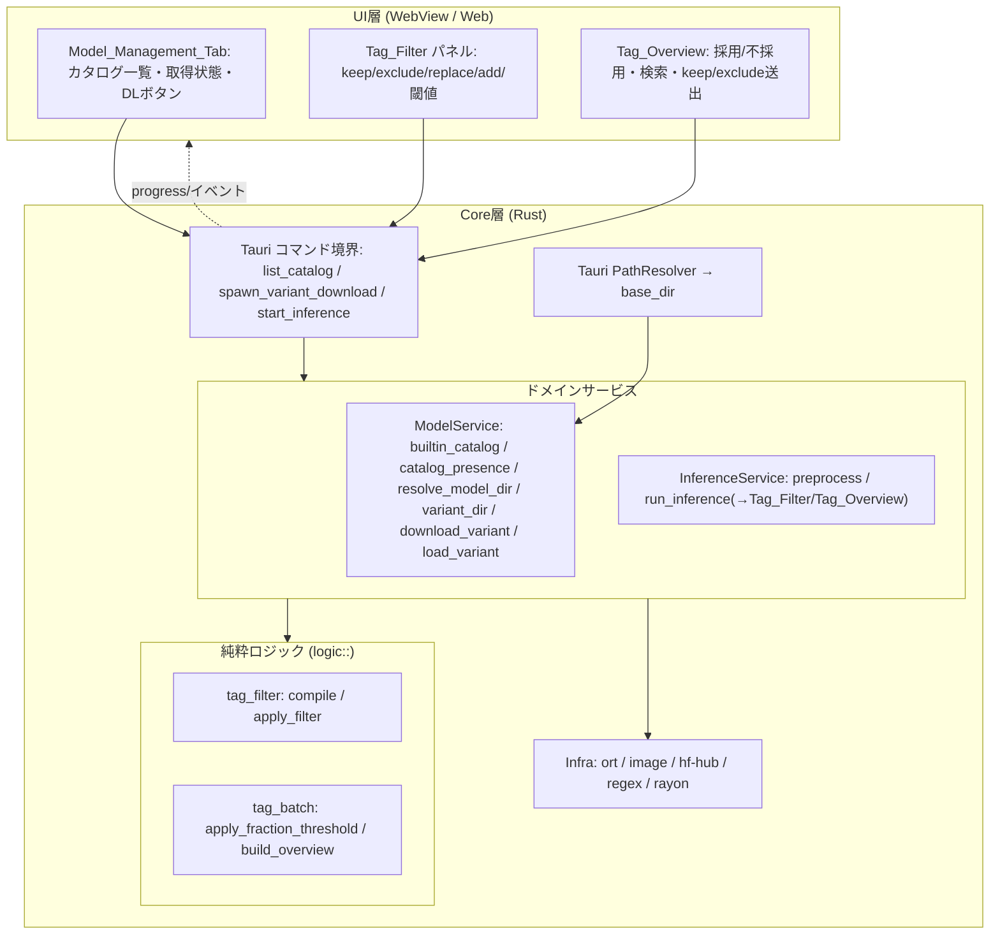
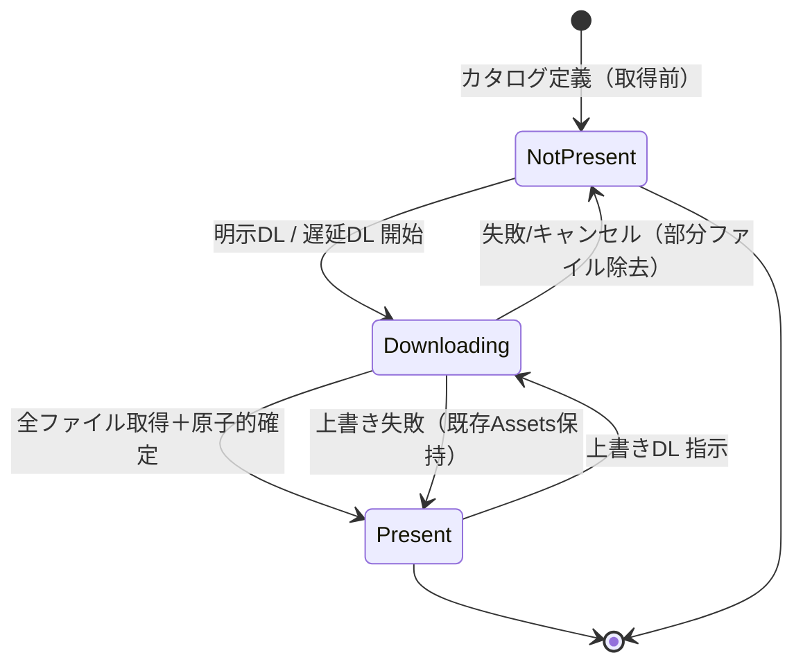
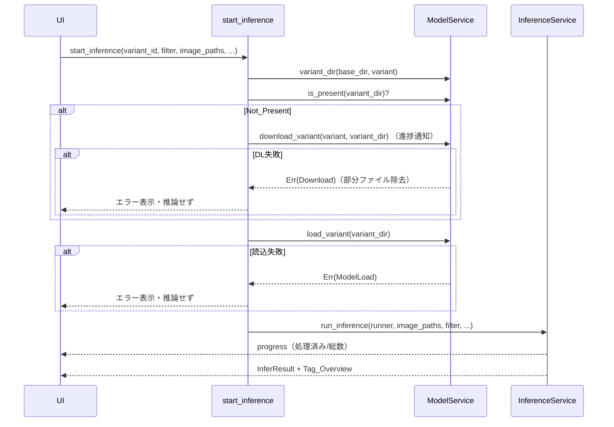

# Design Document

## Overview

本機能は既存 TagEditor（Tauri v2 + Rust、`ort` による ONNX 推論タガー）の「モデル選択・取得・読み込み」を再設計し、推論結果へのタグフィルタとバッチ後タグ一覧を追加する。既存 tag-editor spec の要件 15 系（推論モデルの選択・取得・読込）を置き換え、要件 14 系（閾値採用・Tag_File 書込）をタグフィルタへ拡張する位置づけ。

設計の中核方針は次のとおり。

- **リモート実行の廃止**: 推論は常に Model_Dir 配下のローカル Model_Assets に対してのみ実行する。Model_Source（HuggingFace repo + ファイル指定）は取得（Download_Operation）専用で、推論経路から一切参照しない。現行の `ModelLocation::Remote` を一覧へ混ぜて推論する経路を廃止する。
- **静的カタログと動的存在判定の分離**: 選択肢は静的な `builtin_catalog()`（Model_Variant の定義集合）として与え、取得状態は Model_Dir を走査する動的な存在判定 `catalog_presence()`（Model_Present / Not_Present）として別に求める。カタログの定義と取得状態を混同しない。
- **固定モデル配置フォルダ**: Model_Dir はアプリのインストール基準ディレクトリからの固定相対パスとして解決する。パス解決は純粋関数 `resolve_model_dir(base_dir)` に分離し、実 `base_dir` はアプリ層が Tauri PathResolver から供給する。Variant ごとに一意な保存先（`variant_dir`）を割り当てる。
- **堅牢なダウンロード**: 個々のファイル取得は 30 秒タイムアウト × 最大 3 回リトライ。取得成功後は一時ファイル → リネームで原子的に確定する。失敗・キャンセル時は部分ファイルを除去し開始前の状態へ戻す。上書きダウンロード失敗時は既存 Model_Assets を保持する。既存 `download_model` / `download_model_with_progress` の同期コアを踏襲する。
- **タグフィルタ（Tag_Filter）**: 推論結果に対する採用/不採用の制御を純粋ロジックとして追加する。適用順序は「Replace_Rules でタグ名を書換 → Keep_Tags なら無条件採用 → Exclude_Rules 該当または Confidence_Threshold 未満なら Discarded → それ以外は Adopted」。Additional_Tags は無条件付与。無効な正規表現は当該パターンを不適用とし `InvalidInput` を通知する。
- **バッチ内出現割合（Fraction_Threshold）**: バッチ集計後に純粋関数として適用する（Keep_Tags / Additional_Tags は例外、値 0 なら無効、単一画像には非適用）。
- **バッチ後のタグ一覧（Tag_Overview）**: 採用/不採用タグを代表確信度（出現画像の平均）付きで区別提示し、検索絞り込み、Keep_Tags / Exclude_Rules への送出、更新後フィルタの再反映を提供する。

### 研究サマリ（参照実装 wd14-tagger — 挙動のみ引き継ぐ）

参照実装 stable-diffusion-webui-wd14-tagger の挙動を要約する（ソースはコピーせず、要点のみ言い換える）。

- **モデル定義（`tagger/utils.py`）**: WD14 系（ViT / ConvNeXT / ConvNeXTV2 / SwinV2 / MoaT の各世代）と ML-Danbooru 系（Caformer・TResNet-D）を「表示名 + repo_id (+ リポジトリ内モデルパス)」で保持する。ML-Danbooru は 1 リポジトリに複数の `.onnx` を含み、それぞれを別項目として扱う。本設計では v3 系 WD14（`SmilingWolf/wd-vit-tagger-v3` ほか）と ML-Danbooru ONNX（`deepghs/ml-danbooru-onnx` 内の複数 `.onnx`）を取り込む。
- **フィルタ（`tagger/uiset.py` の `QData`）**: keep（集合）/ exclude（正規表現リスト）/ search→replace（正規表現→置換）/ add に加え、threshold（既定 0.35）と tag_frac_threshold（既定 0.05）を持つ。置換はタグ名補正として採用判定前に適用し、keep は無条件採用、exclude 該当または閾値未満は discarded、finalize でバッチ出現割合が frac 未満のものを discarded へ移送（keep / add は除外）、add は割合 1.0 相当で無条件付与する。正規表現はタグ全体一致（`^...$`）・大小無視でコンパイルする。
- **一覧 UI（`tagger/ui.py`）**: 「採用タグ」「除外タグ」の 2 区分表示、確信度ラベル、検索絞り込み、表示中タグを keep / exclude へ送る操作を提供する。

*上記の外部情報はライセンス遵守のため要約・言い換えを行った。*

## Architecture

本機能は既存 3 層（UI / Tauri コマンド境界 / Core サービス・純粋ロジック）を踏襲する。新規・変更点は Core 側に集中し、UI へは JSON DTO とイベントで公開する。

### レイヤ構成



### モデル状態遷移

各 Model_Variant は「カタログ上の定義」として常に存在し、取得状態のみが遷移する。



- 上書きダウンロード中の失敗は `Present` へ戻る（既存 Model_Assets を保持、要件 5.8）。新規ダウンロード（`NotPresent` 起点）の失敗・キャンセルは `NotPresent` へ戻る（部分ファイル除去、要件 2.6 / 5.4 / 5.6 / 6.5）。

### 遅延ダウンロード（推論時）



### スレッド・進捗・キャンセル

既存の配線を踏襲する。

- **スレッド**: バッチ推論・ダウンロードは `std::thread::spawn` 上の同期コアで実行し、UI スレッドを塞がない（要件 5.2 の推論非阻害、要件 2.7 相当）。バッチ内の画像読込＋前処理は `rayon` でデータ並列に行う。
- **進捗**: `Progress { operation_id, done, total }` を `PROGRESS_EVENT`（`inference://progress`）へ emit する。ダウンロードは取得段階（onnx 取得 → タグ定義取得 → 保存）を `done/total` へ写像し、1 秒以内間隔で更新する（要件 5.3）。
- **キャンセル**: `CancelRegistry` が発行する共有 `AtomicBool` をバッチ境界／取得段の境界で確認する（要件 5.4）。キャンセル時は部分ファイルを除去する（要件 6.5）。

## Components and Interfaces

各サービスは Rust のモジュール／trait として定義し、Tauri コマンドは薄いアダプタとしてサービスへ委譲する。以下はコマンド境界・純粋ロジックの論理インターフェース（言語非依存の擬似シグネチャ）。各項目に対応要件番号を付す。

### ModelService / カタログ・存在判定・配置・取得・読込（要件 1, 2, 3, 5, 6, 7, 8）

- `builtin_catalog() -> Vec<ModelVariant>`
  - wd14-tagger 由来の静的カタログ（WD14 系各バリアント・ML-Danbooru 系）を返す。各 Variant は識別子・表示名・Model_Family を非空で保持する（要件 1.3, 1.5）。1 リポジトリ複数 `.onnx` は各 `.onnx` を個別 Variant とする（要件 1.6）。識別子は全 Variant で一意（要件 1.7, 1.8）。識別子・表示名・Model_Family のいずれかが欠落する候補は登録せず除外情報として保持する（要件 1.4）。
- `catalog_presence(base_dir, catalog) -> Vec<VariantPresence>`
  - カタログ各 Variant について `variant_dir` を走査し、`.onnx` と対応 Tag_Definition_File の対が揃うときのみ Model_Present、それ以外は Not_Present を一意に返す（要件 3.1, 3.2, 3.3, 3.4）。Model_Dir 未作成なら全件 Not_Present（要件 3.5, 3.6）。
- `resolve_model_dir(base_dir) -> PathBuf`
  - インストール基準ディレクトリ `base_dir` からの固定相対パスを結合して Model_Dir を決定する純粋関数（要件 2.1）。同一 `base_dir` に対し常に同一パスを返す（決定性）。実 `base_dir` はアプリ層が Tauri PathResolver から供給する。
- `ensure_model_dir(model_dir) -> Result`
  - Model_Dir が無ければデータ書き込みに先立って作成する（要件 2.2）。作成失敗・権限不足はエラー（要件 2.4, 2.5）。
- `variant_dir(base_dir, variant) -> PathBuf`
  - Variant ごとに一意な保存先（`resolve_model_dir(base_dir)/<variant.id>`）を返す純粋関数（要件 2.3）。identifier が一意（要件 1.7）なので保存先も一意。
- `download_variant(downloader, variant, variant_dir, cancel, on_progress) -> Result<PathBuf>`
  - Model_Source から `model.onnx` とタグ定義を取得し `variant_dir` へ原子的に保存する。30 秒 × 最大 3 回リトライ（要件 6.1, 6.2）。失敗時は失敗ファイル名を含むエラー（要件 6.3）。全取得成功後に原子的確定（要件 6.4）。失敗・キャンセル時は部分ファイル除去（要件 6.5, 5.4, 5.6, 2.6）。ネットワーク不通は開始せずエラー（要件 6.6）。上書き失敗時は既存 Assets 保持（要件 5.8）。既存 `download_model_with_progress` の同期コアを踏襲する。
- `load_variant(variant_dir) -> Result<LoadedModel>`
  - `variant_dir` 配下の `.onnx` と対応 Tag_Definition_File を読み込み `LoadedModel` を構築する（要件 8.1）。ONNX 読込不可・タグ定義解析不可・書込失敗は原因を識別できるエラーで、推論を開始せず既存状態を保持する（要件 8.2, 8.3, 8.4）。既存 `load_local_model` を踏襲する。

### InferenceService / 推論オーケストレーション（要件 4, 7, 9, 10, 11）

- `run_inference(runner, image_paths, filter, batch_size?, labels, input_size, channel_order, operation_id, cancel, progress) -> InferBatchResult`
  - 既存 `run_inference` の `threshold: f32` 引数を `filter: TagFilter` へ拡張する。各画像で確信度を得て Tag_Filter を適用し（要件 9）、バッチなら Fraction_Threshold を適用し（要件 10）、Adopted_Tags を同名 Tag_File へ書込む（要件 9.9）。mp4 除外・個別失敗スキップ・進捗・キャンセルは不変（要件 7.4 のローカルのみ実行を含む）。戻り値に Tag_Overview を含める（要件 11.1）。
  - 推論は常に `runner`（= `variant_dir` からロードした `LoadedModel`）に対してのみ行い、Model_Source を参照しない（要件 7.1, 7.2, 7.4）。ローカルに Assets が無い場合は呼び出し前段（コマンド境界）で `NotFound` として推論しない（要件 7.3, 7.5）。

### logic::tag_filter / タグフィルタの純粋ロジック（要件 9）

- `compile_filter(raw: RawTagFilter) -> (TagFilter, Vec<InvalidPattern>)`
  - Exclude_Rules / Replace_Rules の検索パターンをタグ全体一致（`^...$`）・大小無視でコンパイルする。無効な正規表現は当該パターンを除外し `InvalidPattern`（`InvalidInput` として UI 通知）へ集める（要件 9.7）。有効なパターンだけを含む `TagFilter` を返す。
- `apply_filter(filter, predicted: &[Tag]) -> FilterOutcome`
  - 単一画像の Predicted_Tag 集合へフィルタを適用する。手順（要件 9.2〜9.6, 9.8）:
    1. **Replace**: 各タグ名に Replace_Rules を採用判定前に適用して書き換える（要件 9.5）。
    2. **Keep**: 書換後タグ名が Keep_Tags に含まれれば、Confidence_Threshold 未満・Exclude 該当を問わず Adopted（要件 9.3, 9.8）。
    3. **Exclude / Threshold**: Keep でなく、Exclude_Rules いずれかに一致、または Confidence_Threshold 未満なら Discarded（要件 9.2, 9.4）。
    4. それ以外は Adopted。
    5. **Additional**: Additional_Tags を無条件に Adopted へ加える（要件 9.6）。
  - 戻り値 `FilterOutcome { adopted, discarded }`。各タグは代表確信度算出のため確信度を保持する。

### logic::tag_batch / バッチ集計と一覧（要件 10, 11）

- `apply_fraction_threshold(per_image: &[FilterOutcome], filter, image_count) -> BatchOutcome`
  - 各タグの「採用候補とした画像数 / バッチ対象画像数」を出現割合として算出する（要件 10.1）。割合が Fraction_Threshold 未満で、かつ Keep_Tags / Additional_Tags でないタグを全画像の Adopted から Discarded へ移す（要件 10.2）。`Fraction_Threshold == 0` なら移送しない（要件 10.3）。`image_count == 1`（単一画像）なら適用しない（要件 10.4）。
- `build_overview(batch: &BatchOutcome) -> TagOverview`
  - Adopted / Discarded を区別し、各タグに代表確信度（出現画像の確信度平均）を付与した Tag_Overview を構築する（要件 11.1, 11.2）。
- `search_overview(overview, query) -> TagOverview`
  - 検索文字列にマッチするタグのみへ絞り込む（要件 11.3、大小無視の部分一致）。

### コマンド境界（要件 1, 3, 5, 11）

- `list_catalog(base_dir?) -> CatalogListing { variants: VariantPresence[], excluded: ModelVariant[], model_dir_present: bool }`
  - `builtin_catalog()` と `catalog_presence()` を結合して返す（要件 1.1, 1.2, 3.1, 3.5）。既存 `list_models` を置き換える。
- `spawn_variant_download(variant_id, operation_id) -> Result`
  - 明示ダウンロードを別スレッドで起動し進捗通知する（要件 5.1, 5.2, 5.3, 5.5）。キャンセルは `cancel_operation` 経由（要件 5.4）。既存 `spawn_model_download` を踏襲し、`variant` は `variant_id` からカタログ解決する。
- `start_inference(variant_id, filter, image_paths, batch_size?, operation_id) -> Result`
  - 既存 `start_inference` を拡張する。`variant_id` から `variant_dir` を解決し、Not_Present なら遅延ダウンロード（要件 4.1, 4.2）、Present ならそのままロード（要件 4.3）、失敗系は推論しない（要件 4.4, 4.5, 7.3, 7.5）。`filter` を `run_inference` へ渡す。
- `overview_search(query) / overview_send_keep(tags) / overview_send_exclude(tags) / rerun_inference(...)`
  - Tag_Overview の検索絞り込み（要件 11.3）、表示中タグの Keep_Tags / Exclude_Rules への追加（要件 11.4, 11.5）、更新後フィルタでの同一バッチ再推論と一覧反映（要件 11.6）。

## Data Models

Rust 側のドメインモデル（UI へは JSON DTO として公開）。既存モデルとの差分・移行方針を各所に明記する。

```rust
// --- モデル定義（変更） ---

// Model_Source: 取得元。取得（Download_Operation）専用で推論には用いない（要件7.2）。
// 【移行】既存 ModelLocation { Local(String), Remote(String) } を置き換える。
// Remote を推論経路へ混ぜる余地を型レベルで排除する。
struct ModelSource {
    repo: String,        // HuggingFace repo_id（例 "SmilingWolf/wd-vit-tagger-v3"）
    onnx_file: String,   // リポジトリ内の .onnx パス（1リポジトリ複数onnxを区別、要件1.6）
    tag_files: Vec<String>, // タグ定義候補（先頭優先、例 ["selected_tags.csv"]）
}

// Model_Variant: カタログ登録の個別モデル定義（要件1.3）。
// 【移行】既存 ModelVariant から location/onnx_available を廃止し source を導入。
//         Local family とローカル走査由来の Variant は廃止（リモート取得→ローカル保存
//         →ローカル読込に一本化。推論は常に variant_dir、要件7.1）。
struct ModelVariant {
    id: String,          // 一意な識別子（非空、要件1.3/1.7）
    display_name: String,// 表示名（非空、要件1.3）
    family: ModelFamily, // Wd14 / MlDanbooru（非空、要件1.3）
    source: ModelSource, // 取得元（推論では未使用、要件7.2）
}

// 【移行】ModelFamily から Local を削除（ローカル検出モデルの概念を廃止）。
enum ModelFamily { Wd14, MlDanbooru }

// Model_Present / Not_Present の動的判定結果（要件3.1）。
struct VariantPresence {
    variant: ModelVariant,
    present: bool,       // true=Model_Present, false=Not_Present（要件3.2）
}

// list_catalog の戻り（要件1.1/1.2/3.5）。
struct CatalogListing {
    variants: Vec<VariantPresence>,
    excluded: Vec<ModelVariant>, // 必須フィールド欠落で除外した情報（要件1.4）
    model_dir_present: bool,     // Model_Dir が存在するか（要件3.5）
}

// --- Tag_Filter（新規） ---

// UI から受け取る生のフィルタ設定（正規表現は未コンパイル）。
struct RawTagFilter {
    keep: Vec<String>,            // Keep_Tags（正規化キー、要件9.3）
    exclude: Vec<String>,         // Exclude_Rules の検索パターン（要件9.4）
    replace: Vec<(String, String)>, // Replace_Rules（検索パターン, 置換）（要件9.5）
    additional: Vec<String>,      // Additional_Tags（要件9.6）
    confidence_threshold: f32,    // Confidence_Threshold 0.0〜1.0（要件9.2）
    fraction_threshold: f32,      // Fraction_Threshold 0.0〜1.0（要件10.1, 0で無効10.3）
}

// コンパイル済みフィルタ（無効パターンを除外済み）。
struct TagFilter {
    keep: HashSet<String>,        // 正規化キー集合
    exclude: Vec<Regex>,          // ^...$ 大小無視でコンパイル済み
    replace: Vec<(Regex, String)>,// ^...$ 大小無視でコンパイル済み
    additional: Vec<String>,
    confidence_threshold: f32,
    fraction_threshold: f32,
}

// 無効パターン通知（要件9.7、UI へ InvalidInput として提示）。
struct InvalidPattern { pattern: String, reason: String }

// 単一画像のフィルタ結果（要件9）。
struct FilterOutcome {
    adopted: Vec<Tag>,   // Adopted_Tags（確信度保持、代表確信度算出に使う）
    discarded: Vec<Tag>, // Discarded_Tags
}

// バッチ集計後の結果（Fraction_Threshold 適用後、要件10）。
struct BatchOutcome {
    per_image: Vec<FilterOutcome>, // 画像ごとの最終採用/不採用（書込対象）
    overview: TagOverview,         // 一覧提示用の集計
}

// Tag_Overview: バッチ後のタグ一覧（要件11.1/11.2）。
struct TagOverview {
    adopted: Vec<TagStat>,   // 採用タグ
    discarded: Vec<TagStat>, // 不採用タグ
}

// 一覧の 1 タグ（代表確信度付き、要件11.2）。
struct TagStat {
    name: String,
    representative_confidence: f32, // 出現画像の確信度平均
    image_count: usize,             // 出現画像数（割合算出の根拠）
}

// バッチ推論の結果（既存 InferResult を拡張）。
// 【移行】既存 InferResult の succeeded/failed/excluded/cancelled/messages は不変。
//         overview を追加する。
struct InferBatchResult {
    succeeded: usize,
    failed: usize,
    excluded: usize,
    cancelled: usize,
    messages: Vec<String>,
    overview: TagOverview,   // 追加（要件11.1）
}

// --- 不変（既存のまま） ---
// LoadedModel { session, input_size, channel_order, labels } はそのまま利用。
// LabelDef { name, category }, Tag { body, confidence: Option<f32> },
// Progress { operation_id, done, total } は変更しない。
```

### タグ正規化ルール（既存流儀に整合）

- タグ一致・Keep_Tags 判定は「前後トリム＋大文字小文字無視の完全一致」で統一する（既存 tag-editor design と同一）。
- Exclude_Rules / Replace_Rules の検索パターンはタグ名全体一致（`^...$`）・大小無視の正規表現としてコンパイルする（wd14-tagger の `compile_rex` に相当、要約引き継ぎ）。
- Replace_Rules は採用判定（Keep / Exclude / Threshold）に先立って適用する（要件 9.5）。
- Tag_File 書込はカンマ＋スペース区切りで連結し UTF-8 保存（既存 `render_tags` を再利用、要件 9.9）。

### 移行方針まとめ

| 対象 | 現行 | 変更後 |
|------|------|--------|
| `ModelLocation` | `Local(String)` / `Remote(String)` | 廃止。`ModelSource { repo, onnx_file, tag_files }` へ |
| `ModelVariant.location` / `.onnx_available` | フィールド保持 | 廃止。`source: ModelSource` を追加 |
| `ModelFamily::Local` | ローカル検出モデル | 廃止 |
| `builtin_remote_variants` / `list_models` / `scan_local_models` | ローカル走査混在の一覧化 | `builtin_catalog` / `catalog_presence` / `variant_dir` へ再編 |
| `download_model(_with_progress)` | 同期コア | `download_variant` として踏襲（挙動不変） |
| `load_local_model` | 同期コア | `load_variant` として踏襲（挙動不変） |
| `run_inference(... threshold: f32 ...)` | 閾値のみ | `filter: TagFilter` へ拡張、`overview` を返す |
| `adopt_by_threshold` | 閾値採用 | `tag_filter::apply_filter` へ統合 |

## Correctness Properties

*プロパティとは、システムの全ての妥当な実行にわたって真であるべき特性・振る舞いであり、システムが何をすべきかを形式的に述べたもの。人間可読な仕様と機械検証可能な正しさ保証の橋渡しとなる。*

以下は prework 分析でテスト可能（property）と判定した受入基準を、冗長性を排除して統合したプロパティ。カタログ検証・存在判定・パス解決・フィルタ・バッチ集計は純粋ロジックとして検証し、原子的保存はモックダウンローダ＋一時ディレクトリで検証する（実ネットワーク／実 ONNX ランタイムは統合テストで別途 1〜3 例）。本 spec 内で Property 1 から新規採番する。

### Property 1: カタログ必須フィールドの非空

*任意の* Model_Variant について、`builtin_catalog()` に登録された各 Variant の識別子・表示名・Model_Family はいずれも空でない値を持つ。

**Validates: Requirements 1.3**

### Property 2: カタログ登録・除外の分割

*任意の* Variant 候補列について、カタログへ登録される Variant はすべて識別子・表示名・Model_Family が非空であり、除外される候補はいずれかのフィールドが欠落または空であり、登録集合と除外集合の和は入力候補全体に一致する。

**Validates: Requirements 1.4**

### Property 3: 識別子の一意性

*任意の*（識別子衝突を含みうる）Variant 候補列について、カタログ化後の全 Variant にわたり識別子は一意であり、重複する識別子が 1 つも残らない。同一リポジトリの複数 `.onnx` から生成された Variant も相異なる識別子を持つ。

**Validates: Requirements 1.6, 1.7, 1.8**

### Property 4: Model_Dir 解決の決定性と配下性

*任意の* インストール基準ディレクトリ `base_dir` について、`resolve_model_dir(base_dir)` は同一入力に対し常に同一の絶対パスを返し（決定性）、その結果は `base_dir` を接頭辞に持つ固定相対パスの結合である。

**Validates: Requirements 2.1**

### Property 5: variant_dir の一意性

*任意の* `base_dir` と、識別子が相異なる 2 つの Model_Variant について、`variant_dir` が返す保存先パスは相異なる。

**Validates: Requirements 2.3**

### Property 6: Model_Present 判定の同値性

*任意の* `variant_dir` 配下のファイル構成について、当該 Variant が Model_Present と判定されることは「`.onnx` ファイルが存在し、かつ拡張子 `.csv` または `.json` のタグ定義ファイルが存在する」ことと同値である（`.onnx` のみ・タグ定義のみ・ディレクトリ不在・空ディレクトリはいずれも Not_Present）。

**Validates: Requirements 3.1, 3.2, 3.3, 3.4, 3.5, 3.6**

### Property 7: 保存から存在判定への整合

*任意の* 妥当な `.onnx` バイト列とタグ定義について、それらを `variant_dir` へ保存する Download_Operation が成功すると、当該 Variant は Model_Present と判定される。

**Validates: Requirements 5.5**

### Property 8: 原子的保存の全か無か

*任意の* Download_Operation の結末（成功／取得失敗／保存失敗／キャンセル）について、成功時は `variant_dir` に `.onnx` とタグ定義の対がともに存在し（Model_Present）、失敗またはキャンセル時は当該操作が作成した部分ファイルが残らず Model_Present と判定される Assets が存在しない（Not_Present へ戻る）。

**Validates: Requirements 2.4, 2.6, 4.4, 5.4, 5.6, 6.4, 6.5, 6.6**

### Property 9: 取得の再試行上限

*任意の*「k 回目の取得で初めて成功する（または全失敗する）」トランスポートについて、個々のファイル取得の呼び出し回数は 3 を超えず、`k <= 3` なら取得は成功し、`k > 3`（または全失敗）なら 3 回で打ち切って Download 失敗として終了する。

**Validates: Requirements 6.1, 6.2**

### Property 10: 上書き失敗時の既存 Assets 保持

*任意の* 既に Model_Present である `variant_dir` について、上書き用 Download_Operation が失敗しても、上書き前の `.onnx` とタグ定義の対は保持され、当該 Variant は Model_Present のまま維持される。

**Validates: Requirements 5.8**

### Property 11: Keep_Tags の無条件採用（Keep 優先）

*任意の* Predicted_Tag 集合と Tag_Filter について、Replace 適用後のタグ名が Keep_Tags に含まれるタグは、Confidence_Threshold 未満・Exclude_Rules 該当のいずれであっても Adopted_Tags に採用される。

**Validates: Requirements 9.3, 9.8**

### Property 12: 非 Keep タグの採用同値条件

*任意の* Predicted_Tag と Tag_Filter について、Keep_Tags に含まれないタグが Adopted_Tags に採用されることは「Exclude_Rules のいずれにも一致せず、かつ確信度が Confidence_Threshold 以上である」ことと同値である。

**Validates: Requirements 9.2, 9.4**

### Property 13: Replace_Rules の採用判定前適用

*任意の* Predicted_Tag と Replace_Rules について、採用判定（Keep / Exclude / Threshold）は書き換え後のタグ名に基づいて行われる。すなわち、書き換え後の名前が Keep_Tags／Exclude_Rules に一致するか否かで採用結果が決まる。

**Validates: Requirements 9.5**

### Property 14: Additional_Tags の無条件付与

*任意の* Predicted_Tag 集合と Additional_Tags について、フィルタ適用後の Adopted_Tags は Additional_Tags のすべてのタグを含む。

**Validates: Requirements 9.6**

### Property 15: 無効な正規表現の非適用と通知

*任意の* Exclude_Rules／Replace_Rules の検索パターン列について、コンパイル済み Tag_Filter には正規表現として無効なパターンが 1 つも含まれず、無効なパターンはすべて通知集合（InvalidPattern）に含まれ、採用判定に影響を与えない。

**Validates: Requirements 9.7**

### Property 16: Adopted_Tags の Tag_File 書込一致

*任意の* 画像の FilterOutcome について、Tag_File へ書き込んだ後に読み込むと、その内容は Adopted_Tags を規定の区切り（カンマ＋スペース）で連結した文字列と一致し、Discarded_Tags を含まない。

**Validates: Requirements 9.9**

### Property 17: Fraction_Threshold の採用同値条件

*任意の* バッチの画像ごとフィルタ結果・Fraction_Threshold・Keep_Tags・Additional_Tags について、あるタグが Fraction_Threshold 適用後も Adopted_Tags に残ることは「そのタグの出現割合（採用候補とした画像数 / バッチ対象画像数）が Fraction_Threshold 以上、または Keep_Tags に含まれる、または Additional_Tags に含まれる」ことと同値である（`Fraction_Threshold == 0` では割合条件が常に成立し誰も落ちない）。

**Validates: Requirements 10.1, 10.2, 10.3**

### Property 18: Fraction の単一画像非適用

*任意の* 単一画像（バッチ対象画像数 = 1）のフィルタ結果について、Fraction_Threshold 適用後の Adopted_Tags は適用前と一致する（出現割合による除外を行わない）。

**Validates: Requirements 10.4**

### Property 19: Tag_Overview の網羅と排他

*任意の* バッチのフィルタ結果について、Tag_Overview の採用タグ名集合と不採用タグ名集合の和は、バッチ内に出現した全タグ名（および Additional_Tags）と過不足なく一致し、採用集合と不採用集合は交差しない。

**Validates: Requirements 11.1**

### Property 20: 代表確信度＝出現確信度の平均

*任意の* バッチのフィルタ結果について、Tag_Overview の各タグの代表確信度は、そのタグが出現した画像における確信度の平均に等しい。

**Validates: Requirements 11.2**

### Property 21: Tag_Overview 検索絞り込みの述語一致

*任意の* Tag_Overview と検索文字列について、絞り込み結果にタグが含まれることは、そのタグ名が検索文字列を部分一致（大文字小文字を区別しない）で含むことと同値である。

**Validates: Requirements 11.3**

### Property 22: keep/exclude 送出後の包含

*任意の* Keep_Tags（または Exclude_Rules）集合と送出タグ集合について、Tag_Overview から送出する操作の後、更新後の集合は送出したタグをすべて含む。

**Validates: Requirements 11.4, 11.5**

## Error Handling

エラーは Core の統一型 `AppError`（種別 `AppErrorKind` ＋メッセージ＋対象パス）で表現し、Tauri コマンド境界で `Result<T, AppError>` として UI へ返す。UI は種別に応じた表示を行う。既存の種別で本機能の異常系はすべて充足するため、**新規のエラー種別追加は不要**である。

本機能での種別の割り当て:

- `NotFound`: 推論時に Model_Assets が Model_Dir 配下に存在しない（要件 7.3, 7.5）。
- `AccessDenied`: Model_Dir またはその配下への書き込み権限がない（要件 2.5, 8.4）。
- `InvalidInput`: Exclude_Rules／Replace_Rules の検索パターンが無効な正規表現（要件 9.7）。当該パターンを不適用とし、無効パターン情報を添えて通知する。
- `Io`: Model_Dir 作成失敗・原子的保存の書込／リネーム失敗など一般 I/O（要件 2.4, 6.5, 8.4）。`From<std::io::Error>` により `NotFound`／`AccessDenied`／`AlreadyExists`／`Io` へ写像される。
- `ModelLoad`: `.onnx` が ONNX 形式として読めない、タグ定義が解析できない（要件 8.2, 8.3）。原因を識別できるメッセージを付し、推論を開始せず既存状態を保持する。
- `Download`: ファイル取得がタイムアウト・再試行上限超過・ネットワーク不通で失敗（要件 6.1, 6.2, 6.3, 6.6）。失敗ファイル名をメッセージに含める。
- `Cancelled`: ユーザー操作による Download_Operation／推論の中止（要件 5.4）。

失敗・キャンセル時は原子的保存（一時ファイル → リネーム）と部分ファイル除去により、「読み込める半端な Model_Assets」を残さない（Property 8）。上書きダウンロードの失敗時は既存 Assets を保持する（Property 10）。

## Testing Strategy

### アプローチ

単体テスト（例示・エッジ・エラー）とプロパティテストを併用する。純粋ロジック（カタログ検証・存在判定・パス解決・Tag_Filter・Fraction_Threshold・Tag_Overview）はランタイム非依存で網羅的に検証し、原子的保存・再試行はモックダウンローダ＋一時ディレクトリで検証する。実ネットワークダウンロード・実 ONNX 推論・スレッド／進捗／キャンセル配線は統合テストで 1〜3 例に絞って確認する。

### プロパティテストの構成

- ライブラリはゼロから実装せず、Rust の property-based testing ライブラリ（`proptest`）を採用する。
- 各プロパティテストは最低 **100 回**の反復（ケース生成）で実行する。
- 各プロパティテストには対応する設計プロパティを参照するコメントを付す。
  - タグ形式: **Feature: local-model-management, Property {番号}: {プロパティ本文}**
- 各 Correctness Property は単一のプロパティテストで実装する（Property 1〜22）。
- ジェネレータは以下のエッジを必ずカバーする:
  - Variant 候補: 空フィールド・重複識別子・同一リポジトリ複数 `.onnx`（Property 1, 2, 3）。
  - `base_dir`: 空・末尾区切りあり／なし・非 ASCII（Property 4, 5）。
  - `variant_dir` のファイル構成: `.onnx` のみ・タグ定義のみ・両方・大文字拡張子（`.ONNX`/`.CSV`）・空ディレクトリ・ディレクトリ不在（Property 6, 7, 8）。
  - Download 結末: onnx 取得失敗・タグ定義取得失敗・保存失敗・キャンセル・成功、および `k` 回目成功／全失敗の境界（`k` = 1, 3, 4, ∞）（Property 8, 9）。
  - Tag_Filter: 空の keep/exclude/replace/additional・keep と exclude の双方該当・confidence の境界（0.0/1.0/閾値ちょうど）・confidence なしタグ・無効正規表現混在・replace で keep/exclude に一致する書換（Property 11〜16）。
  - バッチ: 単一画像（image_count = 1）・全画像出現／一部出現・`fraction_threshold` の境界（0.0/割合ちょうど/1.0）・keep/additional 該当（Property 17, 18, 19, 20）。
  - 検索: 空クエリ・大小混在・部分一致・非 ASCII（Property 21）。

### 単体テスト（例示・エッジ・エラー）

- カタログ内容: `builtin_catalog()` が WD14 系各バリアントと ML-Danbooru 系を含み、ML-Danbooru の複数 `.onnx` が個別 Variant として並ぶこと（要件 1.5, 1.6）。
- 読込異常系: `load_variant` が ONNX 読込不可・タグ定義欠落／不正で `ModelLoad` を返し、`LoadedModel` を生成しないこと（要件 8.2, 8.3）。既存 `load_local_model` テストを踏襲する。
- 書込失敗: `download_variant` の保存段が失敗すると使える Assets が残らないこと（要件 2.4, 8.4）。既存テストを踏襲する。

### 統合テスト（PBT を用いない領域、各 1〜3 例）

- 遅延ダウンロード配線: Not_Present → `download_variant` → `load_variant` → `run_inference` の順序、Present なら `download_variant` を呼ばないこと（要件 4.1, 4.2, 4.3, 5.7）。モックダウンローダで確認する。
- 進捗・キャンセル配線: 取得段階が `Progress { done, total }` として emit され、キャンセル要求で取得段の境界で中止されること（要件 5.2, 5.3, 5.4）。
- ローカルのみ実行: `run_inference` が `runner`（`variant_dir` 由来）のみを用い Model_Source を参照しないこと。ネットワーク不通でも Present なら推論が完了すること（要件 7.1, 7.2, 7.4）。型設計により Model_Source が推論 API に現れないことをコンパイル時に担保する。
- Assets 未取得ガード: is_present が false のとき推論前段で `NotFound` を返し推論しないこと（要件 7.3, 7.5）。
- 再推論反映: Tag_Overview から Keep_Tags を更新し同一バッチへ再度 `apply_filter`／`build_overview` を通すと、追加タグが Adopted 側へ移ること（要件 11.6）。`apply_filter` の決定性（同一入力→同一出力）は Property 11〜16 に含意される。

### PBT を用いない領域

- 実ネットワークダウンロード（HuggingFace）・実 ONNX 推論は非決定的かつ高コストのため、100 回反復の property 対象にしない（モックまたは 1〜2 例の統合で確認）。
- UI 表示（Model_Management_Tab のレイアウト、ダウンロードボタンの提示、進捗バー、Tag_Overview の 2 区分表示）は snapshot／手動確認とする（要件 1.1, 1.2, 5.1, 5.3 の表示部分）。
- スレッド起動・イベント emit・`AppHandle` 依存の配線は実行時ランタイムを要するため、同期コアを単体・property で検証し、配線は統合スモークで確認する。
