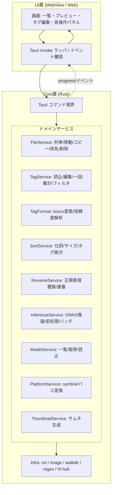

# Design Document

## Overview

TagEditor は Rust + Tauri で実装する軽量デスクトップアプリ。UIはOSの WebView 上で動作するWebフロントエンド、コアロジック（ファイル操作・タグ処理・ONNX推論）はRustネイティブ層に集約する。既存3ツール（NotCoolTagEditor / ImageRenameDotNet8 / wd14-tagger）の機能仕様を統合するが、ソースは参照せず要件のみを引き継ぐ新規実装。

設計の中核方針:

- **責務分離**: UI層は表示と入力受付のみ。全ドメインロジックは Rust Core に集約し、Tauri コマンド境界を唯一の通信路とする。これにより UI 実装差し替えや Core の単体テストが容易になる（要件16-1, 16-2）。
- **軽量性優先**: Electron等の同梱ブラウザを持つフレームワークを避け、OS WebView を利用する Tauri を採用。推論は TensorFlow を排し ONNX Runtime（`ort` クレート）のみに依存させ、依存量とメモリ使用量を抑える（要件16, 15-5）。
- **プラットフォーム階層**: Windows を第一級とし全機能提供。macOS / Linux はベストエフォートで中核機能を提供。Windows固有機能（シンボリックリンク・パス変換）は非Windows環境ではUIから除外する（要件13, 16-3/5/6）。
- **長時間処理の応答性**: バッチ推論・大量ファイル仕訳は Rust 側の別スレッドで実行し、進捗イベントを UI へ push、キャンセルを受付ける。UI スレッドをブロックしない（要件16-7, 17-6/7）。

### 研究サマリ（設計に反映した調査結果）

- **`ort` クレート**: ONNX Runtime の Rust インターフェース（[pykeio/ort](https://github.com/pykeio/ort)）。ハードウェアアクセラレーション対応の推論を担い、`Session` に対して名前付き入力テンソルを渡し出力テンソルを得る API を持つ。WD14系ONNXモデルのRust内推論に用いる（要件14, 15）。内容は要約。
- **WD14モデルの入出力**: WD14系タガー（SmilingWolf系）は概ね 448×448 の正方形入力、BGRチャンネル順・0〜255レンジの画像テンソルを取り、`selected_tags.csv`（category列で rating / general / character を区別）に対応する確信度ベクトルを出力する（[kohya-ss/sd-scripts wd14 tagger doc](https://github.com/kohya-ss/sd-scripts/blob/main/docs/wd14_tagger_README-en.md)）。モデルバリアントごとに入力サイズやチャンネル順が異なりうるため、モデルメタデータから解決する設計とする。内容は要約。
- **Tauri v2 の長時間処理**: `async` コマンドから別スレッド/タスクを spawn し、`emit` で進捗イベントを frontend に送出、`AtomicBool` やイベントでキャンセルシグナルを渡す構成が確立されている（[Tauri events](https://tauritutorials.com/blog/tauri-events-basics)、[git2 進捗表示例](https://dev.to/yexiyue/how-to-implement-git-clone-operation-progress-display-and-cancellation-in-rust-with-tauri-and-git2-37ec)）。この構成をバッチ推論・仕訳・ダウンロードに適用する。内容は要約。

*上記の外部情報はライセンス遵守のため要約・言い換えを行った。*

## Architecture

### レイヤ構成



### 通信方式

- **コマンド（要求応答）**: UI → Core の同期的な要求は Tauri コマンド（`invoke`）で行う。引数と戻り値は JSON シリアライズ可能な DTO。
- **イベント（Core → UI push）**: 進捗・部分結果・エラー通知は Tauri イベント（`emit`）で送出。長時間処理はこの経路で `処理済み件数 / 総件数` を通知する（要件16-7, 17-6）。
- **キャンセル**: 長時間処理には `operation_id` を発行し、UI からのキャンセルコマンドで共有 `AtomicBool` を立てる。Core はループ境界でフラグを確認し中止する（要件17-7）。

### スレッドモデル

- UI イベントループとは別に、重い処理（バッチ推論・大量仕訳・ダウンロード）を `tauri::async_runtime` のタスク／専用スレッドプールで実行する。
- バッチ推論の画像読込・前処理は `rayon` によるデータ並列で行い、前処理済みテンソルを `Batch_Size` 単位に束ねて1回の `Session::run` へ入力する（要件17-1/2）。

### プラットフォーム分岐

- `PlatformService` は `cfg!(windows)` で Windows_Only_Feature の実体を提供。非Windowsではコマンド自体をエラー（未提供）とし、UI は起動時に取得する `capabilities` に基づき該当UIを描画しない（要件13-1/2, 16-6）。

## Components and Interfaces

各サービスは Rust の trait／モジュールとして定義し、Tauri コマンドは薄いアダプタとしてサービスへ委譲する。以下はコマンド境界の論理インターフェース（言語非依存の擬似シグネチャ）。

### FileService / 一覧・プレビュー（要件1, 2）

- `list_images(folder) -> { items: ImageEntry[], truncated: bool, total: usize }`
  - 直下の対応拡張子（jpg/jpeg/png/gif/mp4、大小無視）を列挙。10,000件超は先頭10,000件＋`truncated=true`（要件1-1/2）。
  - フォルダとして読めない場合はエラーを返す（要件1-8）。空なら空配列（UI側で要件1-7表示）。
- `get_thumbnail(path, size) -> ThumbnailData`：size は 64〜512 にクランプ（要件1-4）。読込失敗時は代替表示フラグを返す（要件1-6）。
- `get_preview(path) -> PreviewData`（要件1-5）。
- `read_tag_file(image_path) -> { exists: bool, content: string }`：同名 `.txt` を UTF-8 解釈（要件2-1/2）。
- `write_tag_file(image_path, content) -> WriteResult`：UTF-8 書込。無ければ新規作成（要件2-3/4/5）。失敗時は元内容を保持しエラー（要件2-6）。

### TagService / 一括・集計・フィルタ（要件3, 6, 12）

- `bulk_add_tags(targets, tags) -> BulkResult`：各対象へ追加。重複（トリム+大小無視の完全一致）は追加しない。Tag_File 無しは新規作成（要件3-1/2/5/6, 12）。
- `bulk_remove_tags(targets, tags) -> BulkResult`：一致タグを全除去（要件3-3）。
- `dedup_tags(targets) -> BulkResult`：初出を残し以降を除去（要件3-4）。
- 全一括操作: 個別失敗はスキップし失敗件数を記録（要件3-7）。対象0件は未実行＋通知（要件3-8）。
- `aggregate_tags(folder) -> { tags: TagCount[], unreadable: usize }`：出現回数降順、同数はタグ名昇順。読込失敗ファイルは除外し件数記録（要件6-1/2/3/4）。
- `filter_images(folder, include[], exclude[]) -> ImageEntry[]`：include 全含み かつ exclude いずれも含まない（要件6-5/6/7）。空指定で全件（要件6-8）。

### TagFormat / booru・信頼度変換（要件5）

- `to_booru(tag) -> string`：`_`→スペース、`(`/`)`をバックスラッシュエスケープ（要件5-1/2）。
- `parse_confidence(token) -> { body: string, confidence: Option<f32> }`：`(tag:0.9)` を本体と 0.0〜1.0 の値へ分離。範囲外/非数値は confidence なしの本体扱い（要件5-3/4）。
- `render_tags(tags, show_confidence) -> string`：ON時は `(tag:0.90)`（小数第2位）、OFF時は本体のみ（要件5-5/6）。

### SortService / 仕訳・サイズ・タグ振分（要件7, 9, 10）

- `sort_files(op, source, dest) -> SortResult`：op は gather/distribute/move/copy のいずれか1種（要件7-1）。
  - move/copy は対の Tag_File も同操作、無ければ Image のみ（要件7-2）。
  - gather はサブフォルダ名を接頭辞にして単一宛先へ集約（要件7-3）。
  - distribute はファイル名を接頭辞/元名に分解し接頭辞名サブフォルダへ元名で配置（要件7-4/7）。
  - 同名衝突は上書きせず除外＋記録、対象/宛先不可は未着手でエラー（要件7-5/6）。結果に成功/衝突/スキップ件数（要件7-8）。
- `sort_by_size(threshold, dest_root) -> SortResult`：長辺閾値は 1〜100000 の整数。範囲外/非整数は未実行＋記録（要件9-1/2）。幅高さから縦横（同値は横長）と長辺の閾値以上/未満で宛先を一意決定し移動、対の Tag_File も移動（要件9-3/4/5）。衝突は保持＋記録、寸法取得失敗は除外＋保持＋記録（要件9-6/7）。
- `sort_by_tag(judge_tags[], dest) -> SortResult`：Tag_File に判定タグ（トリム完全一致）いずれか含む→「含む」、含まない/Tag_File無し→「含まない」へ Image と Tag_File を移動（要件10-1/2/3/4）。衝突は保持＋記録、宛先作成不可は未実行＋通知（要件10-5/6）。

### RenameService / 一括置換・連番（要件8）

- `rename_regex(folder, pattern, replacement, numbering?) -> RenameResult`
  - 正規表現でファイル名置換。`NUM` プレースホルダを開始番号から1増分・指定桁ゼロ埋めで展開（ファイル名昇順）（要件8-1/2）。
  - Image 改名時は対の Tag_File も同規則で改名し対を維持（要件8-3）。
  - 不正正規表現はエラーで未実行（要件8-4）。OS禁止文字/既存衝突は当該のみ改名せず記録（要件8-5/6）。

### CaptionService / 孤立キャプション（要件11）

- `find_orphan_captions(folder) -> string[]`：対応 Image の無い Tag_File を特定（要件11-1）。
- `delete_orphan_captions(paths[]) -> { deleted: usize }`：UI が一覧提示・承認後に削除（要件11-2/3/4）。

### PlatformService / Windows限定（要件13）

- `capabilities() -> { windows_only: bool }`：起動時にUIが機能可否を判定（要件13-1/2, 16-6）。
- `create_symlink(link_target, link_path) -> Result`：元不在(要件13-4)、宛先使用中(要件13-5)、権限不足(要件13-6)を個別エラー化。
- `convert_path(path, direction) -> Result<string>`：Win→Linux は `\`→`/`・`C:\`→`/mnt/c/`、Linux→Win は `/`→`\`・`/mnt/c/`→`C:\`。規則不適合は変換不能エラー（要件13-7/8/9）。

### InferenceService / モデル（要件14, 15, 17）

- `run_inference(image_paths[], threshold, batch_size?, operation_id) -> InferResult`
  - 単一/バッチ推論。mp4 は除外（要件14-8）。画像読込不可はスキップ＋記録（要件14-7, 17-8）。
  - `threshold`（0.0〜1.0）以上のタグのみ採用（要件14-4）。採用タグを同名 Tag_File へ書込（既存は上書き）（要件14-5/6）。
  - 個別失敗はスキップし失敗件数記録、残りは継続（要件14-3, 17-8）。
  - 並列前処理＋`Batch_Size` バッチ入力（既定8、範囲1〜64、範囲外は丸めor拒否）（要件17-1/2/3/4/5）。
  - 進捗イベント `処理済み/総数`、キャンセル受付（要件17-6/7）。
- `list_models() -> ModelVariant[]`：WD14系/ML-Danbooru系/ローカル検出モデルを列挙。TF専用（`.onnx`なし）は除外＋対象外提示（要件15-1/5）。
- `load_local_model(dir) -> Result`：`.onnx`＋タグ定義（`.csv`/`.json`）の対を読込（要件15-2）。
- `download_model(variant) -> Result`：`model.onnx`＋タグ定義を取得しローカル保存、次回以降ローカル読込（要件15-3/4）。30秒以内未完了は最大3回再試行し失敗時エラー（要件15-7）。保存失敗はエラー＋推論無効維持（要件15-8）。ONNX読込不可/タグ定義欠落もエラー＋無効維持（要件15-6）。

## Data Models

Rust 側のドメインモデル（UI へは JSON DTO として公開）。

```rust
// 画像エントリ
struct ImageEntry {
    path: String,
    file_name: String,
    has_tag_file: bool,
    thumbnail_available: bool, // 破損等で不可なら false（要件1-6）
}

// タグ（信頼度は任意）
struct Tag {
    body: String,            // 正規化本体（トリム済み）
    confidence: Option<f32>, // 0.0〜1.0（要件5-3）
}

// タグ集計結果の1件
struct TagCount { tag: String, count: usize }

// 仕訳種別（要件7-1）
enum SortingOperation { Gather, Distribute, Move, Copy }

// 各種一括/仕訳の共通結果
struct OperationReport {
    succeeded: usize,
    conflicted: usize, // 名前衝突で除外
    skipped: usize,    // 失敗/対象外で除外
    messages: Vec<String>,
}

// モデルバリアント（要件15-1）
struct ModelVariant {
    id: String,
    display_name: String,
    family: ModelFamily,     // WD14 / MlDanbooru / Local
    location: ModelLocation, // Local(path) / Remote(repo)
    onnx_available: bool,    // false（TF専用）は一覧から除外（要件15-5）
}

// 読み込み済みモデル
struct LoadedModel {
    session: OrtSession,     // ort::Session
    input_size: u32,         // 例 448
    channel_order: ChannelOrder, // BGR / RGB（メタから解決）
    labels: Vec<LabelDef>,   // selected_tags.csv/json 由来
}

struct LabelDef { name: String, category: TagCategory } // rating/general/character

// 推論1画像の結果
struct ImageTagResult {
    image_path: String,
    tags: Vec<Tag>, // threshold 適用前の全確信度、採用は呼び出し側で判定
}

// 進捗イベントペイロード（要件16-7, 17-6）
struct Progress { operation_id: String, done: usize, total: usize }
```

### タグファイルの正規化ルール

- Tag_File はカンマ区切り。読込時に各トークンを前後トリム。空トークンは無視。
- 重複判定・タグ一致判定は「前後トリム＋大文字小文字無視の完全一致」で統一（要件3-2/3/4, 10-1）。
- 書込時はカンマ＋スペース区切りで連結し UTF-8 で保存（要件2-3）。


## Correctness Properties

*プロパティとは、システムの全ての妥当な実行にわたって真であるべき特性・振る舞いであり、システムが何をすべきかを形式的に述べたもの。人間可読な仕様と機械検証可能な正しさ保証の橋渡しとなる。*

以下は prework 分析でテスト可能（property）と判定した受入基準を、冗長性を排除して統合したプロパティ。各操作系プロパティのファイルI/Oは一時ディレクトリ、推論はモックセッションで検証する。

### Property 1: 対応拡張子の列挙

*任意の* ファイル名集合について、フォルダ列挙結果は対応拡張子（jpg / jpeg / png / gif / mp4、大文字小文字を区別しない）を持つ項目のみを含み、対応外拡張子の項目を1つも含まない。

**Validates: Requirements 1.1**

### Property 2: 列挙件数の上限適用

*任意の* 件数 N の入力について、列挙結果の件数は `min(N, 10000)` に等しく、`truncated` フラグは `N > 10000` と一致する。

**Validates: Requirements 1.2**

### Property 3: サムネイルサイズのクランプ

*任意の* 整数サイズ入力について、適用される表示サイズは 64〜512 の範囲内に収まり、入力が既に範囲内であればその値は変化しない。

**Validates: Requirements 1.4**

### Property 4: Tag_File 書込→読込のラウンドトリップと上書き

*任意の* UTF-8 タグ内容について、Tag_File へ書き込んだ後に読み込むと同一の内容が得られ、既存内容の有無に関わらず読み込み結果は最後に書き込んだ内容（既存内容を含まない）と一致する。

**Validates: Requirements 2.1, 2.3, 2.4, 14.5, 14.6**

### Property 5: タグ追加の包含性・非重複・冪等性

*任意の* 既存タグ列と追加タグ集合について、一括追加後の Tag_File は追加タグをすべて含み、正規化キー（前後トリム＋大文字小文字無視）が同一のタグを重複して増やさず、同じ追加をもう一度適用しても結果は変化しない。

**Validates: Requirements 3.1, 3.2, 3.5, 12.1, 12.2, 12.3**

### Property 6: タグ削除の完全除去

*任意の* タグ列と削除タグ集合について、一括削除後の Tag_File には削除対象タグ（正規化キー一致）が1つも残らない。

**Validates: Requirements 3.3**

### Property 7: 重複除去の一意性・順序保存・冪等性

*任意の* タグ列について、重複除去後は正規化キーが一意であり、各キーの初出順序が保持され、もう一度重複除去を適用しても結果は変化しない。

**Validates: Requirements 3.4**

### Property 8: ファイル名正規化

*任意の* basename と拡張子について、`.<ext>.txt` 形式のファイル名は正規化により `<basename>.txt` 形式へ変換される。

**Validates: Requirements 4.1**

### Property 9: Booru 変換

*任意の* タグ文字列について、Booru 変換後の文字列にはアンダースコアが存在せず、エスケープされていない生の括弧 `(` `)` が存在しない。

**Validates: Requirements 5.1, 5.2**

### Property 10: 信頼度トークンの parse/render ラウンドトリップ

*任意の* タグ本体と 0.0〜1.0 の信頼度について、`(tag:conf)` 形式へ描画（小数第2位）したトークンを解析すると、元の本体と小数第2位に丸めた信頼度が復元される。信頼度非表示で描画した文字列には信頼度が含まれない。

**Validates: Requirements 5.3, 5.5, 5.6**

### Property 11: タグ集計の正確性と整列

*任意の* タグ列群について、各タグの集計出現回数は実際の総出現回数に等しく、集計結果は出現回数の降順、同数のタグはタグ名の昇順に整列される。

**Validates: Requirements 6.1, 6.3**

### Property 12: タグフィルタの述語一致

*任意の* 画像タグ集合と包含タグ・除外タグの指定について、ある画像がフィルタ結果に含まれることは「包含タグをすべて含み、かつ除外タグをいずれも含まない」ことと同値であり、包含・除外がともに空なら全画像が結果に含まれる。

**Validates: Requirements 6.5, 6.6, 6.7, 6.8**

### Property 13: 仕訳・改名における Image と Tag_File の対保存

*任意の* Image_File と（存在する場合の）対応 Tag_File について、移動・コピー・サイズ振分・改名の各操作後、対応 Tag_File が存在すれば Image_File と同じ宛先へ同一操作・同一命名規則で配置されて対が維持され、存在しなければ Image_File のみが処理される。

**Validates: Requirements 7.2, 8.3, 9.4, 9.5**

### Property 14: gather/distribute 命名のラウンドトリップ

*任意の* サブフォルダ名とファイル名について、gather による接頭辞付与命名を distribute で分解すると、元のサブフォルダ名とファイル名が復元される。

**Validates: Requirements 7.3, 7.4**

### Property 15: 連番付与の連続性・桁数・一意性

*任意の* 開始番号・桁数・件数について、ファイル名昇順で割り当てた i 番目の番号は `開始番号 + i` に等しく、指定桁数でゼロ埋めされ、割り当てた番号はすべて一意かつ昇順である。

**Validates: Requirements 8.1, 8.2**

### Property 16: 画像サイズ振分先の一意決定

*任意の* 幅・高さ・閾値について、振分先は「向き（幅≧高さを横長、幅<高さを縦長）」と「長辺（=max(幅,高さ)）が閾値以上か未満か」の組み合わせにより、必ずちょうど1つに一意決定される。

**Validates: Requirements 9.3**

### Property 17: 閾値の妥当性判定

*任意の* 整数値について、長辺閾値が妥当であることは `1 ≤ 値 ≤ 100000` と同値である。

**Validates: Requirements 9.2**

### Property 18: タグによる振分先の一意決定

*任意の* 画像タグ集合と判定タグ集合について、その画像が「含む」振分先に分類されることは画像タグと判定タグ（前後トリム完全一致）の交差が非空であることと同値であり、Tag_File が存在しない画像は空集合として「含まない」に分類され、各画像はちょうど1つの振分先へ分類される。

**Validates: Requirements 10.1, 10.2, 10.3, 10.4**

### Property 19: 孤立キャプションの特定

*任意の* Image_File 名集合と Tag_File 名集合について、Orphan_Caption として特定される集合は「対応する basename の Image_File が存在しない Tag_File」の集合とちょうど一致する。

**Validates: Requirements 11.1**

### Property 20: パス変換のラウンドトリップ

*任意の* 妥当な Windows ドライブ表記とパス要素列について、Windows形式→Linux形式→Windows形式の変換は元のパスと一致し、変換後の文字列に変換前OSの区切り文字が混在しない。対象OSのドライブ表記規則に適合しない入力は変換不能として扱われる。

**Validates: Requirements 13.7, 13.8, 13.9**

### Property 21: 推論出力の値域とラベル対応

*任意の* モデル出力について、各タグに付与される信頼度は 0.0〜1.0 の範囲に収まり、結果タグ数はモデルのラベル定義数と一致する。

**Validates: Requirements 14.1**

### Property 22: 信頼度閾値によるタグ採用

*任意の* (タグ, 信頼度) の列と 0.0〜1.0 の閾値について、採用されるタグ集合は信頼度が閾値以上のタグの集合とちょうど一致する。

**Validates: Requirements 14.4**

### Property 23: 動画ファイルの推論除外

*任意の* パス集合について、推論対象からは mp4 拡張子のファイルが必ず除外される。

**Validates: Requirements 14.8**

### Property 24: モデル一覧の ONNX フィルタ

*任意の* モデル候補集合について、モデル一覧に提示される集合は ONNX 形式を持つ（`onnx_available == true`）候補の集合とちょうど一致する。

**Validates: Requirements 15.1, 15.5**

### Property 25: バッチ分割の保存性

*任意の* 件数と Batch_Size について、分割された各チャンクの長さは Batch_Size 以下であり、チャンクを順に連結すると元の列（順序を保存）に一致し、最終チャンク以外の長さはすべて Batch_Size に等しい。

**Validates: Requirements 17.2**

### Property 26: Batch_Size の解決

*任意の* Batch_Size 指定（未指定を含む）について、解決後の値は 1〜64 の範囲に収まり、未指定なら 8、範囲内の指定値はそのまま用いられる。

**Validates: Requirements 17.3, 17.4, 17.5**

## Error Handling

エラーは Core の統一型 `AppError`（種別＋メッセージ＋対象パス）で表現し、Tauri コマンド境界で `Result<T, AppError>` として UI へ返す。UI は種別に応じた表示を行う。

### 方針

- **原子性を要する操作は事前検証**: 仕訳・サイズ振分・タグ振分は、対象/宛先の存在・アクセス可否・閾値妥当性を処理開始前に検証し、不正ならいかなるファイルも変更せずエラーを返す（要件7-6, 9-2, 10-6）。
- **一括処理は部分失敗継続**: タグ一括操作・バッチ推論・仕訳は個別項目の失敗をスキップして継続し、成功/衝突/スキップ件数を `OperationReport` に集計して返す（要件3-7, 6-2, 7-5/7, 8-5/6, 9-6/7, 10-5, 14-3/7, 17-8）。
- **名前衝突は非破壊**: 宛先に同名がある場合は上書きせず対象を保持し、衝突として記録する（要件4-2, 7-5, 8-6, 9-6, 10-5）。
- **書込失敗時の元状態保持**: Tag_File 書込失敗時は元ファイル内容を変更しない。一時ファイル書込→リネームの手順で部分書込を防ぐ（要件2-6, 16-8）。
- **入力破損の局所化**: 個別画像の破損・読込不可は当該項目のみ代替表示/スキップし、一覧・処理全体は継続する（要件1-6, 14-7）。
- **モデル異常は機能無効維持**: ONNX 読込不可・タグ定義欠落・保存失敗は推論機能を無効のまま維持しエラー表示（要件15-6, 15-8）。ダウンロードは30秒タイムアウトで最大3回再試行し、全失敗でエラー（要件15-7）。
- **Windows限定機能の異常系**: symlink はリンク元不在・宛先使用中・権限不足を個別のエラー種別として区別（要件13-4/5/6）。パス変換規則不適合は変換不能エラー（要件13-9）。
- **長時間処理の中断**: メモリ確保・ファイルアクセス失敗時は処理を中断し、処理前状態を保持してエラー表示（要件16-8）。

### AppError 種別（抜粋）

`NotFound` / `AccessDenied` / `AlreadyExists`(衝突) / `InvalidInput`(閾値・正規表現・禁止文字・batch範囲) / `Io` / `ModelLoad` / `Download` / `Unsupported`(非Windowsでの Windows_Only_Feature) / `Cancelled`。

## Testing Strategy

### アプローチ

- **単体テスト（example / edge-case）**: 具体例・境界・異常系を検証。UI表示分岐（要件1-5/7/8, 2-5, 11-2〜4）、部分失敗継続（要件3-7, 14-3, 17-8）、原子性（要件7-6）、衝突保持（要件7-5, 9-6, 10-5）、破損項目継続（要件1-6, 2-6）、モデル異常系（要件15-6/7/8）、symlink 異常系（要件13-4/5/6）、起動時間・UI応答性（要件16-4/7）を対象とする。
- **プロパティテスト（property）**: 上記 Correctness Properties 1〜26 を普遍的性質として検証。純粋ロジック（拡張子判定・クランプ・booru変換・信頼度parse/render・集計・フィルタ・命名規則・連番・振分決定・パス変換・batch分割）はそのまま、I/Oを伴う性質（対保存・書込ラウンドトリップ）は一時ディレクトリ、推論はモックセッションで検証する。
- **統合テスト**: 実 ONNX モデルでの単一推論・小規模バッチを1〜3例で検証（要件14, 15-2/3/4）。実ファイルシステムでの仕訳・改名を代表例で検証。外部サービス挙動（HuggingFace ダウンロード）はモックまたは1〜2例の統合で確認し、100回反復はしない。

### プロパティテストの構成

- ライブラリはゼロから実装せず、Rust の property-based testing ライブラリ（`proptest`）を採用する。
- 各プロパティテストは最低 **100 回**の反復（ケース生成）で実行する。
- 各プロパティテストには対応する設計プロパティを参照するコメントを付す。
  - タグ形式: **Feature: tag-editor, Property {番号}: {プロパティ本文}**
- 各 Correctness Property は単一のプロパティテストで実装する。
- ジェネレータは以下のエッジを必ずカバーする: 空文字列・全空白タグ・大文字小文字混在・非ASCII/マルチバイト・信頼度の境界値(0.0/1.0/範囲外)・幅==高さ・閾値境界(1/100000)・Batch_Size境界(1/64/範囲外/None)・接頭辞を含まないファイル名。

### PBT を用いない領域

- IaC 相当の構成、WebView レンダリング、HuggingFace 等外部サービスの挙動、モデルダウンロードの実ネットワーク、UI表示の見た目、起動時間は property ではなく example / 統合 / スモークで扱う（設計の「PBTを用いない領域」方針に従う）。
